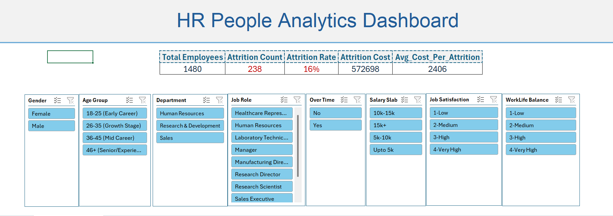
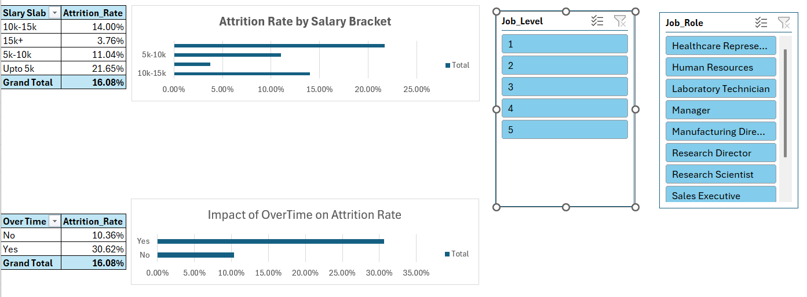
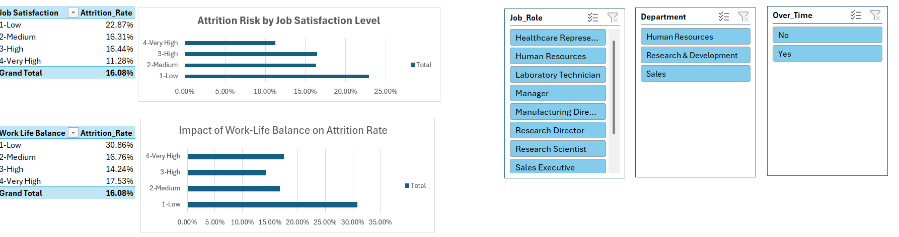
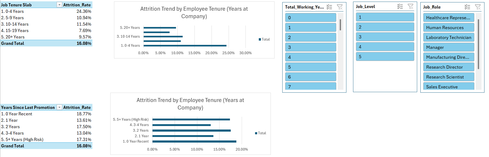
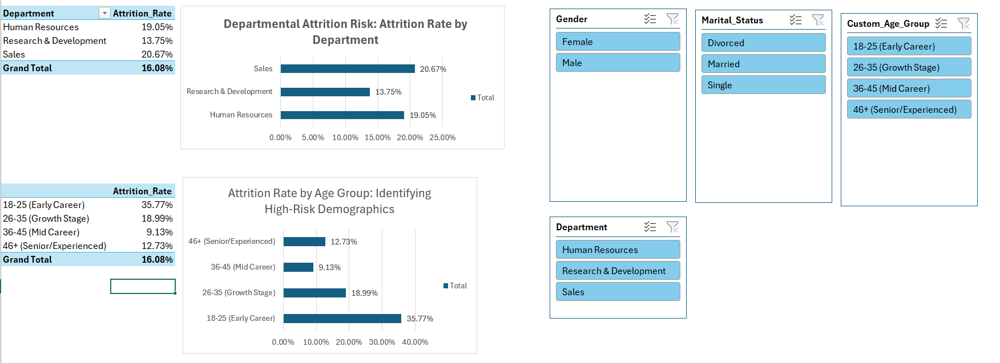

# HR Attrition Analytics Dashboard: Quantifying Turnover Risk

## 1. Project Goal and Strategic Impact

This project transcends standard HR reporting by deploying advanced analytical techniques using Microsoft Excel's Power Pivot ecosystem.

**The core strategic objective is twofold:**
1.  **Predictive Risk Modeling:** To identify and segment high-risk employee populations based on demographic, satisfaction, and career variables.
2.  **Financial Quantification:** To precisely calculate the total financial burden of employee attrition, thereby translating an HR problem into a critical business cost.

The result is a dynamic, interactive tool that allows executive leadership to move beyond guesswork and focus mitigation resources where they yield the highest Return on Investment (ROI).

## 2. Core DAX Logic: Financial and Attrition KPIs

The dashboard's value is derived from robust DAX measures that define organizational health and financial loss.

| KPI Measure | Calculation Logic | Strategic Purpose |
| :--- | :--- | :--- |
| **Attrition Rate** | `DIVIDE(Attrition Count, Total Employees)` | The primary metric to benchmark turnover against industry standards and organizational goals. |
| **Attrition Cost** | `SUMX(FILTER(HR Data, [Attrition]="Yes"), [MonthlyIncome] * 0.5)` | **Quantifies financial loss.** Calculated by summing an estimated cost-to-replace (assumed to be 50% of monthly salary) for every employee who attrited. This provides a direct dollar value for mitigation efforts. |
| **Avg Cost Per Attrition** | `DIVIDE([Attrition Cost], [Attrition Count])` | Allows for benchmarking the cost impact of specific roles or departments. |

## 3. Visual Analysis Breakdown (The Insights Preview)

The images below demonstrate the analytical capabilities, highlighting the crucial relationships between employee factors and turnover risk.

### 3.1 Main Dashboard Control Panel

The primary view provides instant visibility into the three main KPIs and serves as the interactive control center for all analysis with six key slicers (Job Role, Department, Age Group, etc.).

### 3.2 Deep Dive 1: Compensation and Workload Correlation

This section is vital for identifying burnout risk. It reveals the correlation between **low income segments** and employees working **Over Time**. The visual clarity shows whether increased workload, without adequate compensation, directly drives attrition.

* **Key Finding Example:** Often, employees in the lowest salary slab who are forced to work overtime have the highest attrition rates, signaling a critical retention failure point.

### 3.3 Deep Dive 2: Job Satisfaction and Wellbeing

This analysis clearly visualizes the link between employee morale and turnover. Low scores in satisfaction metrics are leading indicators of future attrition risk.

* **Focus Metrics:** Job Satisfaction (1-4 Scale) and Work-Life Balance.
* **Key Finding Example:** Reveals that "Laboratory Technicians" with a low "Job Satisfaction" rating of 1 are leaving at a 3x higher rate than the company average.

### 3.4 Deep Dive 3: Career Progression and Tenure Risk

This visual addresses whether the company provides adequate growth opportunities. Attrition linked to long tenure with no recent promotion is known as 'Stagnation Risk'.

* **Focus Metrics:** Years Since Last Promotion and Total Working Years.
* **Key Finding Example:** Employees who have been with the company for 3-5 years but have not received a promotion in the last 4 years show a sharp spike in attrition.

### 3.5 Deep Dive 4: Demographic and Departmental Risk

This segment segments the workforce to pinpoint specific high-risk organizational units and employee demographics.

* **Focus Metrics:** Attrition rates by Department (e.g., Sales vs. R&D) and Custom Age Group (e.g., Early Career vs. Mid-Career).

## 4. Tecnical Proficiency and Skill Showcase 
This project serves as a showcase of high-level proficiency in Microsoft Excel's Business Intelligence stack, demonstrating an ability to transform raw data into an analytical model.4.1. Data Modeling and Power Pivot MasteryThe foundation of the dashboard is a robust Data Model constructed in Power Pivot, proving the capability to handle and integrate large datasets beyond Excel's traditional row limits.Integrated Model: Establishing relationships between various data tables (where applicable) to ensure seamless filtering across all report sheets.Hierarchical Structure: Implementing time-intelligence or categorical hierarchies to streamline complex calculations and navigation.Performance Optimization: Ensuring the Data Model is optimized for fast calculation speed, even when filtering through multiple interactive slicers.4.2. Complex DAX Logic for Business IntelligenceThe dashboard utilizes specialized $\text{DAX}$ functions to create sophisticated metrics that provide true business value, moving beyond simple SUMs and AVERAGES.Time-Intelligence (Advanced $\text{DAX}$): (If applicable, mention YTD or YoY calculations here) Demonstrating the use of functions like $\text{CALCULATE}$ and $\text{DATESYTD}$ to show trends over time.Financial Simulations: Implementing advanced $\text{DAX}$ logic to create financial measures (like $\text{Attrition Cost}$) that quantify abstract $\text{HR}$ outcomes into concrete monetary value for executive reporting.Custom Classification: Using $\text{DAX}$ or $\text{Power Query}$ to create valuable segmentation columns, such as $\text{Custom\_Age\_Group}$ (Early Career, Growth Stage, etc.), which are crucial for high-value root-cause analysis.4.3. Dynamic Dashboard InteractivityThe final output is not a static report but a fully dynamic analytical tool:Cross-Report Filtering: The six primary $\text{Slicers}$ on the main sheet are connected to all underlying $\text{PivotTables}$ and charts, enabling real-time drill-down analysis across all analytical focus areas (Demographics, Compensation, Satisfaction, etc.).User Experience (UX) Focus: Designing a clean, intuitive interface that makes it easy for non-technical $\text{HR}$ professionals to access complex $\text{DAX}$ calculations and perform ad-hoc analysis.

## 5. Access and Usage

To access the interactive dashboard and utilize the dynamic filtering capabilities powered by Power Pivot and DAX, please follow the steps below:

1.  **Download:** Download the `HR_Attrition_Dashboard.xlsx` file.
2.  **View:** Open the file using Microsoft Excel (Excel 2016 or newer recommended).

3.  **Analyze:** Use the interactive slicers to drill down into the high-risk segments identified above.

